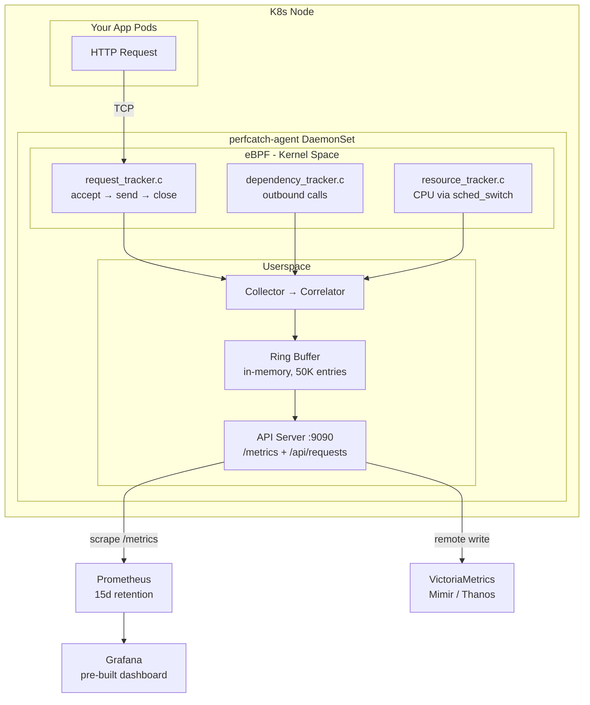

# PerfCatch

**eBPF-based per-request performance monitoring for Kubernetes Application — zero code changes required.**

PerfCatch measures CPU time, memory, network I/O, and duration for **every individual HTTP request** hitting your pods. It captures correlation IDs from HTTP headers to trace requests across services and exposes real-time metrics via Prometheus + Grafana.

---

## Features

- **Per-request granularity** — CPU, memory, duration, and network bytes for each individual request
- **Real CPU time** — Uses `sched_switch` tracepoint for actual on-CPU nanoseconds (not wall-clock approximation)
- **Correlation ID tracking** — Automatically extracts trace/correlation IDs from HTTP headers (configurable)
- **Zero instrumentation** — eBPF attaches to kernel functions; no SDK, sidecar, or code changes needed
- **High-throughput storage** — In-memory ring buffer handles 500+ req/s with zero I/O
- **Prometheus histograms** — Bounded-cardinality aggregate metrics for long-term trending
- **Per-request gauges** — Rolling window of individual requests for Grafana table/detail view
- **Optional Remote Write** — Push per-request metrics to VictoriaMetrics/Mimir/Thanos for long-term storage
- **Optional SQLite persistence** — Disk-backed storage for standalone mode (no Prometheus)
- **Grafana dashboard** — Pre-built dashboard with request table, histograms, and filtering
- **Helm chart** — Single command deployment with configurable monitoring stack

---

## Architecture



---

## Storage Architecture

PerfCatch uses a **layered storage** approach optimized for different throughput levels:

| Layer | Purpose | Survives Restart? |
|-------|---------|-------------------|
| **Ring Buffer** (default) | In-memory deque (50K entries). Fast API serving, zero I/O | No |
| **Prometheus** (default) | Scrapes histograms + per-request gauges. PVC for TSDB | Yes (15d retention) |
| **Remote Write** (optional) | Pushes per-request metrics to VictoriaMetrics | Yes (30d+ retention) |
| **SQLite** (standalone) | Disk persistence via hostPath. For no-Prometheus setups | Yes (on-node) |

At **500 req/s**, the ring buffer holds ~100 seconds of history. Prometheus scrapes aggregate histograms every 15s (bounded cardinality). Per-request detail is available in the rolling gauge window (200 correlated + 50 uncorrelated recent requests).

---

## What It Measures

| Metric | Source | Description |
|--------|--------|-------------|
| **Duration (ms)** | `accept()` → `tcp_close()` | Total request wall-clock time |
| **CPU Time (ms)** | `sched_switch` tracepoint | Actual on-CPU execution time |
| **CPU %** | cpu_time / duration × 100 | CPU utilization per request |
| **Memory RSS** | `/proc/<pid>/status` | Process memory at request time |
| **Network RX** | `tcp_recvmsg` | Bytes received per request |
| **Network TX** | `tcp_sendmsg` | Bytes sent per request |
| **Correlation ID** | HTTP headers (eBPF capture) | Request tracing across services |
| **HTTP Method/Path** | First bytes of request | GET /path extracted from TCP stream |
| **Dependencies** | `tcp_v4_connect` | Outbound calls made during request |

---

## Quick Start

### Prerequisites

- Kubernetes cluster (Minikube, EKS, GKE, AKS, etc.)
- Helm 3.x
- Linux kernel 4.18+ on worker nodes
- `kubectl` configured for your cluster

### 1. Deploy with Helm

```bash
# Clone the repository
git clone https://github.com/your-org/perfcatch.git
cd perfcatch

# Install with bundled monitoring stack (Prometheus + Grafana)
helm install perfcatch charts/perfcatch \
  -n perfcatch --create-namespace \
  --set config.namespace=<target-namespace>

# Or install without monitoring (standalone with SQLite persistence)
helm install perfcatch charts/perfcatch \
  -n perfcatch --create-namespace \
  --set monitoring.enabled=false \
  --set config.namespace=<target-namespace>
```

### 2. Verify the agent is running

```bash
kubectl -n perfcatch get pods
# NAME              READY   STATUS    RESTARTS   AGE
# perfcatch-xxxxx   1/1     Running   0          30s

# Check logs
kubectl -n perfcatch logs -l app.kubernetes.io/name=perfcatch
```

### 3. Access Grafana dashboard

```bash
# Port-forward Grafana
kubectl -n monitoring port-forward svc/grafana 3000:3000

# Open http://localhost:3000
# Login: admin / perfcatch
# Dashboard: "PerfCatch - eBPF Request Metrics"
```

### 4. Generate test traffic with correlation IDs

```bash
# Deploy sample app
kubectl apply -f examples/sample-app/k8s-manifests.yaml

# Send requests with correlation ID
curl -H "X-Correlation-ID: order-12345" http://<your-app>/endpoint
curl -H "X-Request-ID: trace-abc" http://<your-app>/compute
```

---

## Deployment Options

### Option 1: Full Stack (Default)

Deploys PerfCatch agent + Prometheus (with PVC) + Grafana with pre-configured dashboard.

```bash
helm install perfcatch charts/perfcatch -n perfcatch --create-namespace
```

### Option 2: Full Stack + VictoriaMetrics (High-Cardinality Storage)

For long-term per-request storage. VictoriaMetrics receives all individual requests via Remote Write.

```bash
helm install perfcatch charts/perfcatch -n perfcatch --create-namespace \
  --set monitoring.victoriametrics.enabled=true
```

### Option 3: Agent Only (Existing Prometheus)

For clusters that already have Prometheus. PerfCatch pods include scrape annotations automatically.

```bash
helm install perfcatch charts/perfcatch -n perfcatch --create-namespace \
  --set monitoring.enabled=false
```

Prometheus discovers perfcatch via pod annotations:
```yaml
prometheus.io/scrape: "true"
prometheus.io/port: "9090"
prometheus.io/path: "/metrics"
```

### Option 4: Standalone (No Prometheus, API-only)

For teams scraping the perfcatch API directly. SQLite persistence is auto-enabled on a hostPath volume.

```bash
helm install perfcatch charts/perfcatch -n perfcatch --create-namespace \
  --set monitoring.enabled=false \
  --set prometheusAnnotations.enabled=false
```

Data is persisted at `/var/lib/perfcatch/data.db` on each node and survives pod restarts.

### Option 5: Agent + ServiceMonitor (Prometheus Operator)

For clusters using the Prometheus Operator with ServiceMonitor CRDs.

```bash
helm install perfcatch charts/perfcatch -n perfcatch --create-namespace \
  --set monitoring.enabled=false \
  --set serviceMonitor.enabled=true \
  --set serviceMonitor.labels.release=prometheus
```

---

## Configuration

### Helm Values

| Parameter | Default | Description |
|-----------|---------|-------------|
| **Image** | | |
| `image.repository` | `devopsart1/perfcatch` | Container image |
| `image.tag` | `latest` | Image tag |
| **Agent Config** | | |
| `config.namespace` | `""` (all) | Target namespace to monitor |
| `config.pods` | `""` (all) | Comma-separated pod names to monitor |
| `config.apiPort` | `9090` | Metrics API port |
| `config.logLevel` | `INFO` | Log level (DEBUG, INFO, WARNING, ERROR) |
| `config.bufferSize` | `50000` | Ring buffer capacity (max requests in memory) |
| `config.flushInterval` | `2` | Flush interval in seconds |
| `config.correlationHeaders` | `""` | Extra correlation headers (comma-separated) |
| `config.remoteWriteUrl` | `""` | Prometheus Remote Write endpoint URL |
| **Persistence** | | |
| `persistence.enabled` | `false` | Enable SQLite on hostPath (auto-enabled when monitoring=false) |
| `persistence.hostPath` | `/var/lib/perfcatch` | Node path for data storage |
| `persistence.dbFile` | `data.db` | SQLite database filename |
| **Resources** | | |
| `resources.requests.cpu` | `100m` | CPU request |
| `resources.requests.memory` | `256Mi` | Memory request |
| `resources.limits.cpu` | `500m` | CPU limit |
| `resources.limits.memory` | `512Mi` | Memory limit |
| **Monitoring Stack** | | |
| `monitoring.enabled` | `true` | Deploy Prometheus + Grafana |
| `monitoring.namespace` | `monitoring` | Monitoring stack namespace |
| `monitoring.prometheus.scrapeInterval` | `15s` | Prometheus scrape interval |
| `monitoring.prometheus.retention` | `15d` | Prometheus data retention |
| `monitoring.prometheus.storage.size` | `5Gi` | Prometheus PVC size |
| `monitoring.prometheus.nodePort` | `30090` | Prometheus NodePort |
| `monitoring.grafana.adminPassword` | `perfcatch` | Grafana admin password |
| `monitoring.grafana.anonymousAuth` | `true` | Allow anonymous Grafana access |
| `monitoring.grafana.nodePort` | `30030` | Grafana NodePort |
| **VictoriaMetrics** | | |
| `monitoring.victoriametrics.enabled` | `false` | Deploy VictoriaMetrics for per-request storage |
| `monitoring.victoriametrics.image` | `victoriametrics/victoria-metrics:latest` | VM image |
| `monitoring.victoriametrics.retention` | `30d` | Data retention period |
| `monitoring.victoriametrics.storage.size` | `10Gi` | PVC size |
| **Scrape Config** | | |
| `prometheusAnnotations.enabled` | `true` | Add prometheus.io annotations to pods |
| `serviceMonitor.enabled` | `false` | Create ServiceMonitor CRD |
| `serviceMonitor.interval` | `15s` | Scrape interval |

### Environment Variables

| Variable | Default | Description |
|----------|---------|-------------|
| `PERFCATCH_NAMESPACE` | `""` | Target namespace |
| `PERFCATCH_PODS` | `""` | Comma-separated pod filter |
| `PERFCATCH_BUFFER_SIZE` | `50000` | Ring buffer max entries |
| `PERFCATCH_FLUSH_INTERVAL` | `2` | Flush interval seconds |
| `PERFCATCH_LOG_LEVEL` | `INFO` | Logging level |
| `PERFCATCH_API_PORT` | `9090` | API server port |
| `PERFCATCH_CORRELATION_HEADERS` | `""` | Custom headers (comma-separated) |
| `PERFCATCH_REMOTE_WRITE_URL` | `""` | Remote Write endpoint |
| `PERFCATCH_DB_PATH` | `""` | SQLite path (enables persistence) |

### Custom Correlation Headers

PerfCatch automatically extracts correlation/trace IDs from these built-in headers:

- `x-correlation-id`
- `x-request-id`
- `x-trace-id`
- `traceparent` (W3C Trace Context — extracts trace-id)
- `x-amzn-trace-id`
- `request-id`
- `correlation-id`

To add custom headers:

```bash
helm install perfcatch charts/perfcatch -n perfcatch --create-namespace \
  --set config.correlationHeaders="x-my-session-id,x-custom-trace,x-internal-id"
```

Custom headers are checked **before** the built-in defaults, so they take priority.

---

## Grafana Dashboard

The pre-built dashboard ("PerfCatch - eBPF Request Metrics") includes 8 panels:

| Panel | Type | Description |
|-------|------|-------------|
| Request Count by Service | Time-series | Aggregate request counter per namespace/pod/process |
| Request Duration (ms) | Time-series | Duration histogram and per-request series |
| CPU Time (ms) | Time-series | Per-request CPU consumption |
| Memory RSS (bytes) | Time-series | Memory usage per request |
| Network RX (bytes) | Time-series | Bytes received per request |
| Network TX (bytes) | Time-series | Bytes sent per request |
| Max Request Duration (ms) | Stat | Peak latency indicator |
| Individual Requests | Table | Full per-request detail with all columns |

### Dashboard Variables
- **namespace** — Filter by Kubernetes namespace
- **application** — Filter by process name
- **pod** — Filter by pod name
- **correlation_id** — Filter by correlation ID (supports regex)

### Importing to Existing Grafana

```bash
# Extract the dashboard JSON from the Helm chart
helm template perfcatch charts/perfcatch -n perfcatch \
  | yq 'select(.metadata.name == "grafana-dashboard-perfcatch") | .data["perfcatch.json"]' \
  > perfcatch-dashboard.json

# Import via Grafana UI: Dashboards → Import → Upload JSON
```

---

## Metrics Reference

### Histogram Metrics (Bounded Cardinality)

Aggregate distributions suitable for long-term storage and alerting:

| Metric | Buckets | Description |
|--------|---------|-------------|
| `perfcatch_request_duration_ms_bucket` | 1,2,5,10,25,50,100,250,500,1000,2500,5000,10000,+Inf | Request duration distribution |
| `perfcatch_request_cpu_ms_bucket` | 0.5,1,2,5,10,25,50,100,250,500,1000,+Inf | CPU time distribution |

### Per-Request Gauge Metrics (Rolling Window)

Individual request detail with unique `request_id` label (rolling window of ~200 correlated + 50 uncorrelated):

| Metric | Labels | Description |
|--------|--------|-------------|
| `perfcatch_req_duration_ms` | request_id, correlation_id, namespace, pod, process, port, method, path | Request duration |
| `perfcatch_req_cpu_ms` | (same) | CPU time consumed |
| `perfcatch_req_memory_bytes` | (same) | Memory RSS |
| `perfcatch_req_bytes_rx` | (same) | Bytes received |
| `perfcatch_req_bytes_tx` | (same) | Bytes sent |
| `perfcatch_req_start_time` | (same) | Start timestamp (epoch ms) |
| `perfcatch_req_end_time` | (same) | End timestamp (epoch ms) |

### Counter/Gauge Metrics

| Metric | Labels | Description |
|--------|--------|-------------|
| `perfcatch_requests_total` | namespace, pod, process, port | Total request count |
| `perfcatch_request_duration_ms_max` | namespace, pod, process, port | Max duration seen |
| `perfcatch_buffer_size` | — | Current entries in ring buffer |
| `perfcatch_buffer_capacity` | — | Max ring buffer capacity |

---

## API Endpoints

The agent exposes an HTTP API on port 9090 (configurable):

| Endpoint | Method | Description |
|----------|--------|-------------|
| `/metrics` | GET | Prometheus metrics (histograms + gauges) |
| `/api/requests` | GET | Query individual requests (JSON) |
| `/health` | GET | Health check |

### Query Parameters for `/api/requests`

| Parameter | Description |
|-----------|-------------|
| `process` | Filter by process name |
| `namespace` | Filter by namespace |
| `pod` | Filter by pod name |
| `correlation_id` | Filter by correlation ID |
| `limit` | Max results (default: 50) |
| `since` | Minutes to look back (default: 5) |

### Example Response

```json
{
  "count": 1,
  "requests": [
    {
      "request_id": "req-1779636025668-007696",
      "timestamp": 1779636025.668,
      "pid": 583307,
      "process_name": "uvicorn",
      "pod_name": "sample-app-5879fb87f5-zcfbr",
      "namespace": "sample-app",
      "service_name": "sample-app",
      "local_port": 8000,
      "remote_ip": "10.244.0.42",
      "duration_ms": 9.24,
      "cpu_time_ms": 8.90,
      "memory_rss_bytes": 53518336,
      "bytes_received": 161,
      "bytes_sent": 170,
      "correlation_id": "order-12345",
      "http_method": "GET",
      "http_path": "/compute"
    }
  ]
}
```

---

## CLI Usage

```bash
# Install CLI locally
pip install -e .

# Copy DB from agent pod (only if persistence is enabled)
kubectl -n perfcatch cp \
  $(kubectl -n perfcatch get pod -l app.kubernetes.io/name=perfcatch -o jsonpath='{.items[0].metadata.name}'):/var/lib/perfcatch/data.db \
  ./data.db

# Generate report
perfcatch --db ./data.db report -n <namespace>

# View specific request
perfcatch --db ./data.db detail <request-id>

# List services
perfcatch --db ./data.db services

# Alert on slow requests
perfcatch --db ./data.db alerts -n <namespace> --threshold-duration 100
```

---

## Building the Image

```bash
# Multi-platform build and push
docker buildx build --platform linux/amd64,linux/arm64 \
  -t devopsart1/perfcatch:latest --push -f src/Dockerfile .
```

---

## Project Structure

```
perfcatch/
├── src/
│   ├── Dockerfile                  # Agent container image (BCC + kernel headers)
│   ├── entrypoint.sh              # Container entrypoint (kernel header overlay)
│   └── perfcatch/
│       ├── agent/
│       │   ├── bpf/
│       │   │   ├── request_tracker.c    # eBPF: accept/send/recv/close + sched_switch + HTTP header capture
│       │   │   ├── dependency_tracker.c # eBPF: outbound tcp_v4_connect tracking
│       │   │   └── resource_tracker.c   # eBPF: CPU time via sched_switch
│       │   ├── collector.py        # Loads BPF programs, parses events, extracts correlation IDs
│       │   ├── correlator.py       # Correlates request + dependency + resource events
│       │   └── daemon.py           # Agent main loop (ring buffer + optional SQLite + remote write)
│       ├── api/
│       │   └── server.py           # HTTP API + Prometheus metrics (histograms + per-request gauges)
│       ├── store/
│       │   ├── ringbuffer.py       # In-memory ring buffer (collections.deque, maxlen=50000)
│       │   ├── remote_write.py     # Prometheus Remote Write client (background push)
│       │   ├── backend.py          # SQLite persistence (optional, for standalone mode)
│       │   └── models.py           # Data models
│       ├── cli/
│       │   ├── main.py             # CLI commands
│       │   └── report.py           # Report formatting
│       └── k8s/
│           └── metadata.py         # PID/IP/comm → Pod/Namespace/Service resolution
├── charts/perfcatch/               # Helm chart
│   ├── Chart.yaml
│   ├── values.yaml
│   └── templates/
│       ├── daemonset.yaml          # Agent DaemonSet (privileged, hostPID, hostNetwork)
│       ├── configmap.yaml          # Agent env vars
│       ├── serviceaccount.yaml
│       ├── clusterrole.yaml        # K8s API access (pods, services, nodes)
│       ├── clusterrolebinding.yaml
│       ├── servicemonitor.yaml     # Prometheus Operator (optional)
│       ├── prometheus.yaml         # Bundled Prometheus + PVC (optional)
│       ├── grafana.yaml            # Bundled Grafana (optional)
│       ├── grafana-dashboard.yaml  # Pre-built dashboard JSON
│       └── victoriametrics.yaml    # VictoriaMetrics single-node (optional)
├── examples/sample-app/            # Test application (FastAPI + httpbin)
├── tests/                          # Unit tests
├── pyproject.toml
├── Makefile
└── README.md
```

---

## Requirements

**Agent (runs in cluster):**
- Linux kernel 4.18+ (BPF support)
- BCC (BPF Compiler Collection) — included in container image
- Privileged DaemonSet with: `hostPID`, `hostNetwork`, `SYS_ADMIN`, `SYS_PTRACE`, `NET_ADMIN`, `BPF`, `PERFMON`

**CLI (runs locally):**
- Python 3.10+
- `kubectl` access to cluster

---

## Troubleshooting

### Agent not capturing requests

```bash
# Check agent logs
kubectl -n perfcatch logs -l app.kubernetes.io/name=perfcatch -f

# Verify eBPF programs loaded (look for "eBPF programs loaded successfully")
# Verify PIDs tracked (look for "Tracking N PIDs")

# Ensure kernel headers are linked
kubectl -n perfcatch exec <pod> -- ls /lib/modules/$(uname -r)/build/include/linux/kconfig.h
```

### Ring buffer shows 0 but agent is running

- Events fire on `tcp_close()` — HTTP keep-alive connections won't emit until closed
- Send requests with `Connection: close` header to test
- Check if target namespace PIDs match: the agent logs PID count on startup

### No metrics in Prometheus

```bash
# Verify agent is exposing metrics
kubectl -n perfcatch port-forward <pod> 9090:9090
curl http://localhost:9090/metrics | grep perfcatch_buffer_size

# Check Prometheus targets
kubectl -n monitoring port-forward svc/prometheus 9090:9090
# Open http://localhost:9090/targets — should show perfcatch as "up"
```

### Correlation IDs not appearing

- Ensure your app sends a supported header (see [Custom Correlation Headers](#custom-correlation-headers))
- Headers are matched case-insensitively
- The eBPF program captures the first ~512 bytes of the HTTP request — ensure headers are early in the request
- `traceparent` extracts the trace-id field (2nd segment split by `-`)

### Pod crashes with "Read-only file system"

The entrypoint creates a kernel header symlink. If `/lib/modules` is read-only (common in Docker Desktop/minikube), the entrypoint uses a `mount --bind` overlay automatically. Ensure the container runs as `privileged: true`.

---

## Contributors

- [Devopsart](https://github.com/DevOpsArts)

---

## License

MIT
